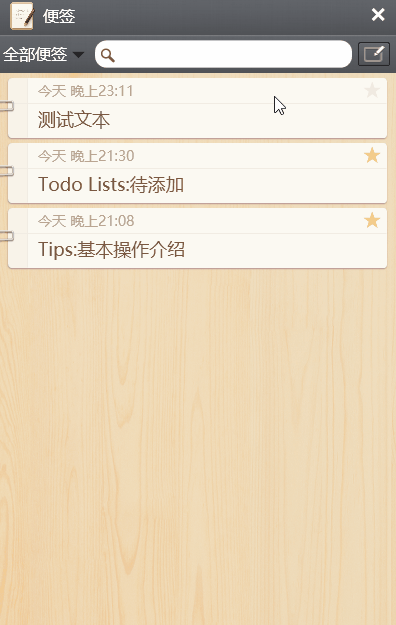

仿锤子便签  *基于WPF*
----

> Screenshot：效果预览

> Tips:基本操作介绍

- 在便签列表页点击右上角的按钮可新建一条便签
- 在便签列表页点击便签列表左边的别针按钮可删除该标签
- 在便签列表页搜索框输入可以对标签关键字搜索

> Todo Lists:待添加

- 保存为图片
- Markdown
- 增加设置
- 闹钟提醒
- 回收站、加星便签、自定义文件夹